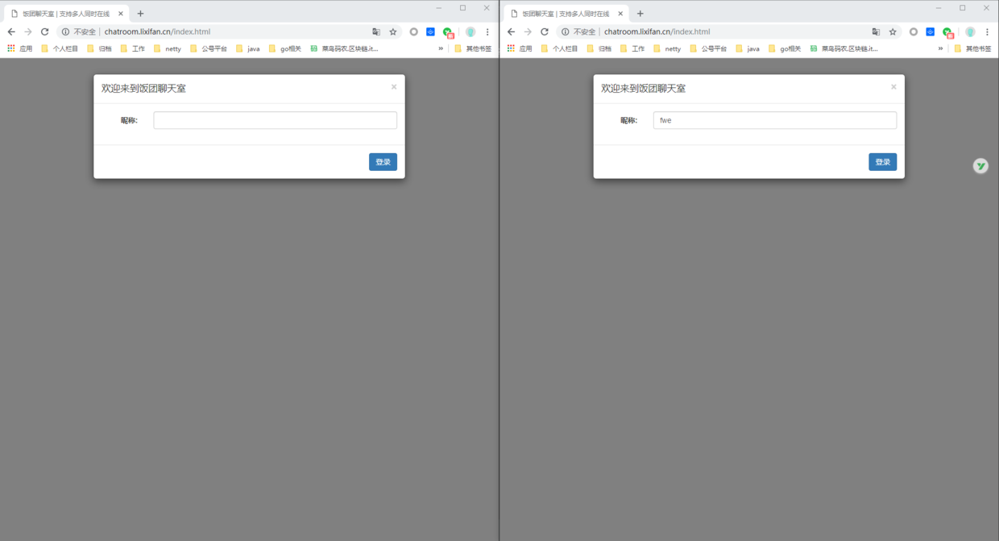
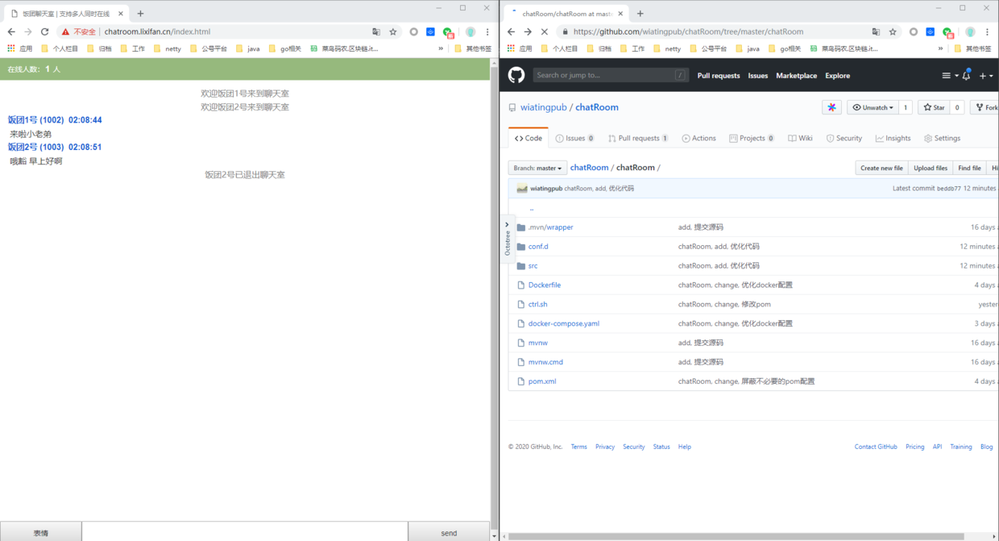

## 饭团聊天室

#### 外网部署

http://chatroom.lixifan.cn/index.html

#### 技术栈

- springboot
- netty，通讯模块使用的是netty，采用的是websocket通讯协议【聊天模块做成了组件的形式，任意项目直接导入即可使用】
- docker，为了方便部署，这里采用的是docker的部署方式
- nginx，反向代理
- html&css&js，前段随便撸的一个东西，轻喷

#### 设计亮点

- 通讯模块直接做成了组件，和实际工程分离，其他工程随导随用；
- 使用了协议分发机制，接收到客户端协议后会根据协议id自动找到对应facade下的method，通过反射触发；
- 新增了Api注解，工程启动时构建协议和对应method的映射，提供协议分发机制使用；
- 心跳机制监听，客户端定时发送ping协议包，如果异常断开，服务端一定时间没有接受到ping包后会断开连接

#### 界面表现
大概说说界面表现的东西，随便写的html页面。

登陆界面，这里开了两个端，输入昵称即可登陆，之后开始聊天

下线后的表现如下

下线后便监听到啦

#### ide如何启动

- idea导入chatRoom工程，点击File->Project Structure->点击Modules内的+导入lib下的socket组件
- 点击启动即可服务端，监听的端口可以修改resources下的application.properties
- 客户端相关的放在chatRoomWeb下，直接访问即可

#### 相关文章解析

[通用解析组件的设计与实现](https://mp.weixin.qq.com/s/WpFSYki8fRpqHv96NqwK_Q)

#### 外网部署

可以关注公众号向我咨询

